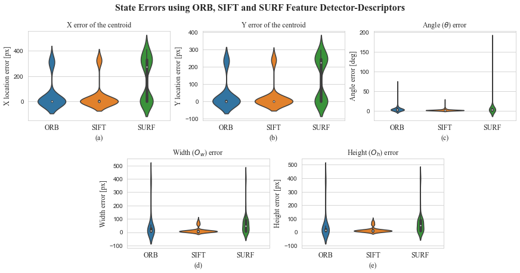
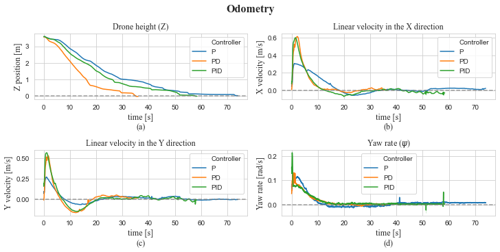

# Autonomous Landing Data Analysis
This project is the data analysis of the results obtained from a simulation of an autonomous landing system of a UAV using ROS and Gazebo. In the [autonomous_landing_uav](https://github.com/MikeS96/autonomous_landing_uav) repository you can find the simulation of the UAV (DJI f450) from which the data was obtained to perform the analysis.

 

       

## Requirements
Python3:
 * jupyter-notebook
 * pandas
 * matplotlib
 * seaborn

## Detection Analysis
The [detection analysis](/detection_analysis.ipynb) is the analysis of the errors obtained from the detection process of the landing system to locate the landing platform. This detection process was performed three times using three different detectors: ORB, SIFT and SURF. The objective of this analysis was to determine which of the detectors have a better performance using five states that represents the position of te platform in the images obtaine from the UAV's camera:

 - Centroid X coordinate of the platform
 - Centroid Y coordinate of the platform
 - Height of the platform
 - Width of the platform
 - Angle (between the platform and the horizontal of the image)

    

It was decided that the SIFT detector has a better performance because for each error a graph of vilin plots comparing the three detectors was made and the SIFT detector had a median closer to zero and that the standard deviation was the smaller compared to the other two detectors.

## Controller Errors Analysis
The [controller error analysis](/controller_errors_analysis.ipynb) is the analysis of the errors obtained from the autonomous landing process on the platform. The errors are the (x, y) coordinates of the centroid and the angle of the platform respect to the horizontal of the drone's camera. All errors are expected to be close zero.

    

## Controller States Analysis
The [controller states analysis](/controller_states_analysis.ipynb) is the analysis of the controller states (same states of the detection analysis). Here it is expected that the width and height of the estimation of the landing platform increases as the drone lands, while the (x, y) centroind coordinates are expected to be (320, 240) as this coordinate is the center of the image size of the drone's camera (640x480). The angle it is expected to tend to zero, because to land the landing platform must be aligned with the horizontal of the drone's camera.

    

## Controller Velocity Analysis
The [controller velocity analysis](/controller_velocity_analysis.ipynb) is the analysis of the Z position of the UAV during the landing process, its x and y linear velocities and its yaw rate. Here, two datasets where used, the local and the odometry data of the drone. This analysis was made to observe the behaviour of the controller while the drone was landing, it was expected that all variables involved tend to zero since the height of the drone decreases as it landed and the speeds should be zero once the drone landed, also the yaw rate must be zero because it is the Z angular velocity and it becomes zero once the drone is aligned with the platform.

    

